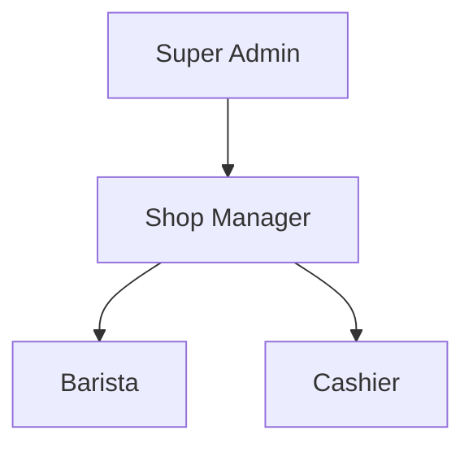
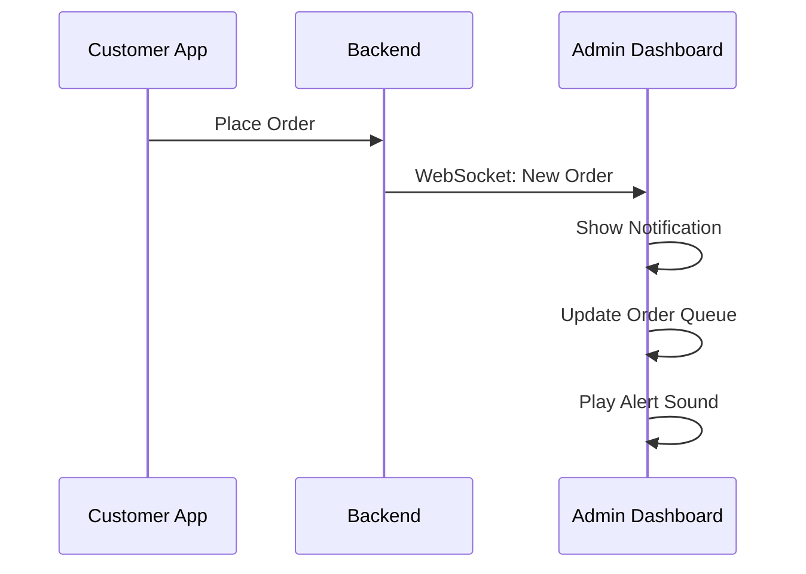
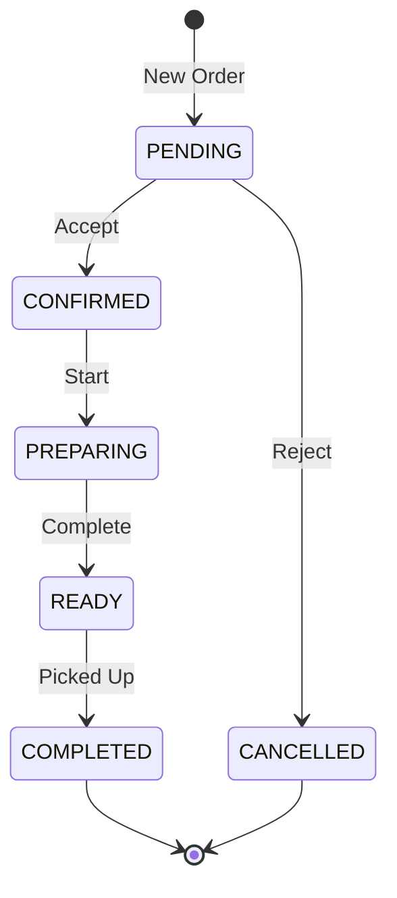

# Admin Dashboard Features Specification

## 🎯 Overview

The Coffee Shop Admin Dashboard is a comprehensive management system designed for coffee shop owners and staff to efficiently manage operations, track sales, and provide excellent customer service. Built with desktop-first responsive design, it offers powerful tools while maintaining simplicity and ease of use.

## 👥 User Roles & Permissions

### Role Hierarchy


### Permission Matrix

| Feature | Super Admin | Shop Manager | Barista | Cashier |
|---------|------------|--------------|---------|----------|
| **Dashboard** |
| View Analytics | ✅ | ✅ | ❌ | ✅ |
| Export Reports | ✅ | ✅ | ❌ | ❌ |
| **Menu Management** |
| Create Items | ✅ | ✅ | ❌ | ❌ |
| Edit Items | ✅ | ✅ | ❌ | ❌ |
| Delete Items | ✅ | ✅ | ❌ | ❌ |
| Toggle Availability | ✅ | ✅ | ✅ | ❌ |
| **Order Processing** |
| View Orders | ✅ | ✅ | ✅ | ✅ |
| Update Status | ✅ | ✅ | ✅ | ❌ |
| Cancel Orders | ✅ | ✅ | ❌ | ❌ |
| **Customer Management** |
| View Customers | ✅ | ✅ | ❌ | ✅ |
| Edit Customer Info | ✅ | ✅ | ❌ | ❌ |
| Adjust Rewards | ✅ | ✅ | ❌ | ❌ |
| **Settings** |
| Shop Configuration | ✅ | ✅ | ❌ | ❌ |
| User Management | ✅ | ❌ | ❌ | ❌ |
| System Settings | ✅ | ❌ | ❌ | ❌ |

## 📊 Dashboard Features

### 1. Overview Dashboard
Primary landing page providing at-a-glance business insights.

#### Key Metrics Cards
- **Today's Revenue**: Real-time sales total with comparison to yesterday
- **Orders Count**: Total orders with status breakdown
- **Average Order Value**: Current AOV with trend indicator
- **Active Customers**: Unique customers served today

#### Sales Chart
- **Time Range**: Today, Week, Month, Year
- **Chart Types**: Line graph for trends, Bar chart for comparisons
- **Metrics**: Revenue, Order count, Customer count
- **Export**: PDF, Excel, CSV formats

#### Recent Orders Widget
```typescript
interface RecentOrder {
  orderId: string;
  customerName: string;
  items: string[];
  total: number;
  status: OrderStatus;
  timeAgo: string;
}
```

#### Popular Items
- Top 5 best-selling items today
- Sales count and revenue per item
- Quick availability toggle

### 2. Real-Time Notifications


## 🍵 Menu Management

### Product CRUD Operations

#### Create New Product
```typescript
interface CreateProductForm {
  name: string;
  nameEn?: string;  // English name
  description: string;
  descriptionEn?: string;
  category: string;
  price: number;
  image: File;
  sizes: ProductSize[];
  customizations: Customization[];
  tags: string[];
  available: boolean;
}

interface ProductSize {
  name: string;  // 小杯, 中杯, 大杯
  priceModifier: number;
}

interface Customization {
  type: string;  // 甜度, 温度, 加料
  options: CustomizationOption[];
}
```

#### Bulk Operations
- **Batch Price Update**: Adjust prices by percentage or fixed amount
- **Category Move**: Move multiple items between categories
- **Availability Toggle**: Enable/disable multiple items
- **Export/Import**: CSV format for menu management

### Category Management
- Drag-and-drop reordering
- Category icons and colors
- Active/inactive status
- Item count display

### Image Management
- **Upload**: Drag-and-drop or browse
- **Optimization**: Auto-resize to 800x800px
- **Formats**: JPG, PNG, WebP
- **Gallery**: Reusable image library

## 📦 Order Processing

### Order Queue Interface

#### Layout Design
```
┌─────────────────────────────────────────────────────┐
│  Pending (5)  │  Preparing (3)  │  Ready (2)        │
├───────────────┴─────────────────┴──────────────────┤
│  ┌─────────────┐  ┌─────────────┐  ┌─────────────┐ │
│  │ Order #1234 │  │ Order #1235 │  │ Order #1236 │ │
│  │ 张三        │  │ 李四        │  │ 王五        │ │
│  │ 2 items     │  │ 1 item      │  │ 3 items     │ │
│  │ ¥56.00      │  │ ¥28.00      │  │ ¥84.00      │ │
│  │ 5 min ago   │  │ 8 min ago   │  │ 12 min ago  │ │
│  └─────────────┘  └─────────────┘  └─────────────┘ │
└─────────────────────────────────────────────────────┘
```

#### Order Card Features
- Customer name and contact
- Order items with customizations
- Preparation time tracking
- Quick status update buttons
- Print receipt option

### Order Status Workflow


### Order Details Modal
- Complete order information
- Customer history sidebar
- Item-by-item status
- Internal notes
- Refund/modify options

## 👥 Customer Management

### Customer List View
- **Search**: By name, phone, email
- **Filters**: Order frequency, total spent, last visit
- **Sort**: Name, join date, order count, total spent
- **Bulk Actions**: Export, send notifications

### Customer Profile
```typescript
interface CustomerProfile {
  // Basic Info
  id: string;
  name: string;
  email: string;
  phone: string;
  avatar?: string;
  joinedDate: Date;
  
  // Statistics
  totalOrders: number;
  totalSpent: number;
  averageOrderValue: number;
  favoriteItems: MenuItem[];
  lastOrderDate: Date;
  
  // Rewards
  currentPoints: number;
  totalEarnedPoints: number;
  totalRedeemedPoints: number;
  tier: 'Bronze' | 'Silver' | 'Gold' | 'Platinum';
  
  // Preferences
  preferredPickupTime?: string;
  dietaryRestrictions?: string[];
  notes?: string;
}
```

### Customer Actions
- View complete order history
- Adjust reward points
- Add internal notes
- Send targeted promotions
- Block/unblock customer

## 📈 Analytics & Reports

### Sales Analytics

#### Revenue Metrics
- **Time Periods**: Daily, Weekly, Monthly, Quarterly, Yearly
- **Comparisons**: Previous period, same period last year
- **Breakdowns**: By category, by item, by hour
- **Visualizations**: Line charts, bar charts, pie charts

#### Performance Indicators
```typescript
interface PerformanceMetrics {
  revenue: {
    current: number;
    previous: number;
    change: number;
    trend: 'up' | 'down' | 'stable';
  };
  orders: {
    count: number;
    averageValue: number;
    peakHour: string;
    popularDay: string;
  };
  customers: {
    new: number;
    returning: number;
    churnRate: number;
  };
  products: {
    topSelling: ProductSales[];
    lowPerforming: ProductSales[];
    outOfStock: number;
  };
}
```

### Report Generation
- **Formats**: PDF, Excel, CSV
- **Templates**: Daily summary, monthly report, inventory report
- **Scheduling**: Automated email delivery
- **Customization**: Select metrics and date ranges

### Data Export
- Transaction logs
- Customer database
- Product performance
- Financial summaries

## ⚙️ Settings & Configuration

### Shop Settings
```typescript
interface ShopConfiguration {
  // Basic Information
  name: string;
  nameEn?: string;
  address: string;
  phone: string;
  email: string;
  
  // Operating Hours
  hours: {
    [key: string]: {  // monday, tuesday, etc.
      open: string;   // "08:00"
      close: string;  // "22:00"
      closed: boolean;
    };
  };
  
  // Special Dates
  holidays: Holiday[];
  
  // Business Rules
  minOrderAmount: number;
  maxAdvanceOrderDays: number;
  preparationTime: number;  // minutes
  
  // Payment
  acceptedPayments: PaymentMethod[];
  taxRate: number;
  serviceCharge?: number;
}
```

### Notification Settings
- Order notifications (sound, desktop, email)
- Low stock alerts
- Daily summary emails
- Customer milestone alerts

### Integration Settings
- Payment gateway configuration
- SMS service setup
- Email template customization
- Third-party POS integration

## 🎨 UI/UX Design Guidelines

### Design Principles
1. **Efficiency First**: Minimize clicks for common tasks
2. **Information Density**: Show relevant data without clutter
3. **Responsive Tables**: Adapt to tablet screens
4. **Keyboard Shortcuts**: Speed up repetitive tasks
5. **Consistent Feedback**: Clear success/error states

### Component Library

#### Data Tables
- Sortable columns
- Inline editing
- Bulk selection
- Pagination
- Column visibility toggle

#### Form Patterns
- Inline validation
- Auto-save drafts
- Bulk edit mode
- Import/export templates

#### Navigation
- Fixed sidebar
- Breadcrumb trail
- Quick search
- Keyboard navigation

### Color Scheme
```scss
// Admin-specific colors
$admin-primary: #2D3748;      // Slate gray
$admin-secondary: #4A5568;    // Medium gray
$admin-accent: #FE9870;       // Coffee orange
$admin-success: #48BB78;      // Green
$admin-warning: #ED8936;      // Orange
$admin-danger: #F56565;       // Red
$admin-info: #4299E1;         // Blue

// Status colors
$status-pending: #ECC94B;     // Yellow
$status-preparing: #4299E1;   // Blue
$status-ready: #48BB78;       // Green
$status-completed: #A0AEC0;   // Gray
$status-cancelled: #F56565;   // Red
```

## 🔧 Technical Implementation

### Frontend Architecture
```typescript
// Admin route structure
/admin
  /dashboard          // Overview
  /menu              // Menu management
    /items           // Product list
    /items/new       // Create product
    /items/:id       // Edit product
    /categories      // Category management
  /orders            // Order processing
    /queue           // Live orders
    /history         // Past orders
    /:id             // Order details
  /customers         // Customer management
    /list            // Customer list
    /:id             // Customer profile
  /analytics         // Reports & analytics
    /sales           // Sales reports
    /products        // Product performance
    /customers       // Customer insights
  /settings          // Configuration
    /shop            // Shop settings
    /users           // User management
    /integrations    // Third-party services
```

### State Management
```typescript
interface AdminState {
  user: AdminUser;
  dashboard: DashboardState;
  orders: OrderQueueState;
  menu: MenuManagementState;
  customers: CustomerState;
  analytics: AnalyticsState;
  settings: SettingsState;
  notifications: NotificationState;
}
```

### Real-Time Features
- WebSocket connection for live updates
- Optimistic UI updates
- Offline queue for actions
- Conflict resolution

## 🚀 Performance Optimization

### Loading Strategies
- Lazy load analytics charts
- Virtualized tables for large datasets
- Image lazy loading with placeholders
- Code splitting by route

### Caching Strategy
- API response caching
- Static asset caching
- IndexedDB for offline support
- Service worker implementation

### Search Optimization
- Debounced search inputs
- Full-text search indices
- Fuzzy matching
- Search result caching

## 🔐 Security Measures

### Authentication
- JWT token validation
- Role-based route guards
- Session timeout (30 minutes)
- Two-factor authentication (optional)

### Data Protection
- API rate limiting
- Input sanitization
- SQL injection prevention
- XSS protection

### Audit Trail
```typescript
interface AuditLog {
  id: string;
  userId: string;
  action: string;
  resource: string;
  resourceId: string;
  previousValue?: any;
  newValue?: any;
  ipAddress: string;
  userAgent: string;
  timestamp: Date;
}
```

### Compliance
- GDPR data export
- Customer data anonymization
- PCI compliance for payments
- Regular security audits

## 📱 Mobile Considerations

While desktop-first, the admin dashboard maintains usability on tablets:

### Tablet Optimizations
- Collapsible sidebar
- Touch-friendly buttons (44px targets)
- Swipe gestures for order cards
- Responsive data tables
- Portrait/landscape layouts

### Mobile Restrictions
- View-only mode on phones
- Emergency actions only
- Redirect to desktop notice
- SMS notifications for urgent items

## 🌟 Future Enhancements

### Phase 1 (Current)
- ✅ Basic dashboard
- ✅ Menu management
- ✅ Order processing
- ✅ Customer list
- ✅ Simple analytics

### Phase 2 (Planned)
- [ ] Advanced analytics with ML insights
- [ ] Inventory management with suppliers
- [ ] Staff scheduling
- [ ] Marketing campaigns
- [ ] Loyalty program management

### Phase 3 (Future)
- [ ] Multi-location support
- [ ] Franchise management
- [ ] AI-powered demand forecasting
- [ ] Integration marketplace
- [ ] White-label options

---

This admin dashboard empowers coffee shop owners to run their business efficiently while maintaining focus on what matters most - serving great coffee and creating happy customers.