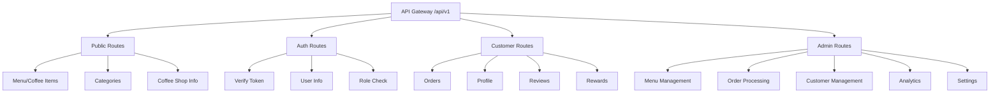
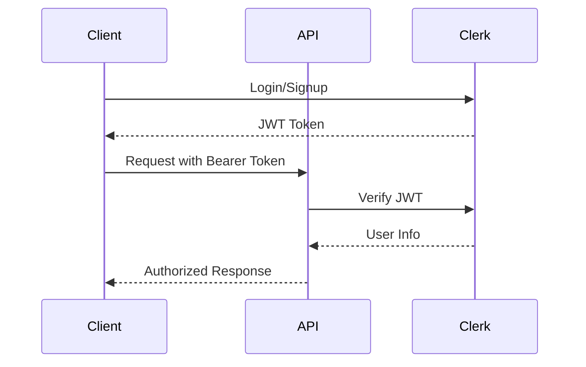
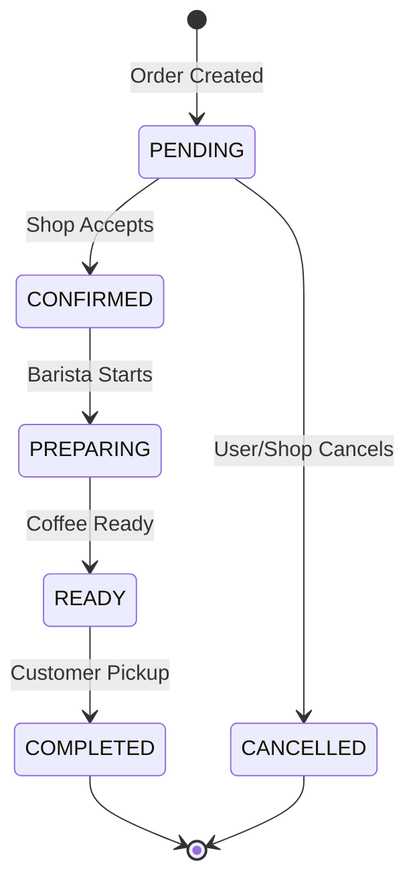

# Coffee Shop API Documentation

## 🌐 API Structure



## 🔒 Authentication

The API uses Clerk JWT tokens for authentication:



### Headers Required
```http
Authorization: Bearer <jwt_token>
Content-Type: application/json
```

### Role-Based Access
Admin endpoints require additional role verification:
- User must have `admin` role in Clerk metadata
- Backend validates role on each admin request
- Non-admin users receive 403 Forbidden

## 📍 API Endpoints

### Base URL
```
Development: http://localhost:5001/api/v1
Production: https://api.coffeeshop.com/api/v1
```

### 🔓 Public Routes (No Auth Required)

#### Get Coffee Menu Items
```http
GET /menu/items
GET /menu/items?category=<categoryId>
```

Response:
```json
[
  {
    "id": "123",
    "name": "卡布奇诺",
    "description": "经典意式咖啡，奶泡绵密",
    "price": 25.00,
    "categoryId": "espresso",
    "imageUrl": "/images/cappuccino.jpg",
    "available": true
  }
]
```

#### Get Single Coffee Item
```http
GET /menu/items/{itemId}
```

#### Get Categories
```http
GET /menu/categories
```

Response:
```json
[
  {
    "id": "espresso",
    "name": "浓缩咖啡",
    "description": "意式浓缩咖啡系列",
    "sortOrder": 1
  }
]
```

### 🔐 Authenticated Customer Routes

#### Get Current User
```http
GET /auth/me
```

Response:
```json
{
  "id": "user123",
  "email": "customer@example.com",
  "name": "张三",
  "phone": "13800138000",
  "role": "CUSTOMER"
}
```

#### Create Order
```http
POST /orders
```

Request:
```json
{
  "items": [
    {
      "coffeeId": "123",
      "quantity": 2,
      "size": "MEDIUM",
      "notes": "少糖"
    }
  ],
  "type": "PICKUP"
}
```

Response:
```json
{
  "id": "order123",
  "orderNumber": "ORD-2024-0001",
  "total": 56.00,
  "status": "PENDING",
  "createdAt": "2024-01-01T10:00:00Z"
}
```

#### Get Orders
```http
GET /orders
```

#### Get Single Order
```http
GET /orders/{orderId}
```

#### Cancel Order
```http
POST /orders/{orderId}/cancel
```

#### Get Rewards
```http
GET /rewards
```

Response:
```json
{
  "currentPoints": 150,
  "totalEarned": 500,
  "totalRedeemed": 350,
  "lastUpdated": "2024-01-01T10:00:00Z"
}
```

#### Create Review
```http
POST /reviews
```

Request:
```json
{
  "coffeeId": "123",
  "rating": 5,
  "comment": "很好喝！"
}
```

### 👨‍💼 Admin Routes (Protected - Admin Role Required)

#### Create Menu Item
```http
POST /menu/items
```

Request:
```json
{
  "name": "新品咖啡",
  "description": "限时特供精品咖啡",
  "price": 38.00,
  "categoryId": "specialty",
  "imageUrl": "/images/new-coffee.jpg",
  "available": true
}
```

Response:
```json
{
  "id": "item123",
  "name": "新品咖啡",
  "description": "限时特供精品咖啡",
  "price": 38.00,
  "categoryId": "specialty",
  "imageUrl": "/images/new-coffee.jpg",
  "available": true
}
```

#### Update Menu Item
```http
PUT /menu/items/{itemId}
```

Request:
```json
{
  "name": "更新咖啡名称",
  "price": 35.00,
  "available": false
}
```

#### Delete Menu Item
```http
DELETE /menu/items/{itemId}
```

Response:
```json
{
  "message": "Menu item deleted"
}
```

#### Get All Orders (Admin)
```http
GET /admin/orders
```

Response:
```json
[
  {
    "id": "order123",
    "orderNumber": "ORD-2024-0001",
    "userId": "user123",
    "customerName": "张三",
    "items": [...],
    "total": 56.00,
    "status": "PENDING",
    "createdAt": "2024-01-01T10:00:00Z"
  }
]
```

#### Update Order Status
```http
PUT /admin/orders/{orderId}/status
```

Request:
```json
{
  "status": "PREPARING"
}
```

Response:
```json
{
  "id": "order123",
  "status": "PREPARING",
  "updatedAt": "2024-01-01T10:05:00Z"
}
```

#### Get Analytics
```http
GET /admin/analytics
```

Response:
```json
{
  "dailySales": {
    "total": 5680.00,
    "orderCount": 156,
    "averageOrderValue": 36.41
  },
  "popularItems": [
    {
      "itemId": "123",
      "name": "拿铁咖啡",
      "salesCount": 45,
      "revenue": 1260.00
    }
  ],
  "hourlyDistribution": [
    {"hour": 8, "orders": 23},
    {"hour": 9, "orders": 45}
  ]
}
```

#### Get Customer List
```http
GET /admin/customers
```

Response:
```json
{
  "customers": [
    {
      "id": "user123",
      "name": "张三",
      "email": "zhangsan@example.com",
      "phone": "13800138000",
      "totalOrders": 25,
      "totalSpent": 680.00,
      "joinedAt": "2023-12-01T00:00:00Z"
    }
  ],
  "pagination": {
    "page": 1,
    "limit": 20,
    "total": 150
  }
}
```

#### Get Customer Details
```http
GET /admin/customers/{customerId}
```

#### Update Settings
```http
PUT /admin/settings
```

Request:
```json
{
  "shopName": "精品咖啡店",
  "openingHours": {
    "monday": "08:00-22:00",
    "tuesday": "08:00-22:00"
  },
  "taxRate": 0.06
}
```

## 🔄 Order Status Flow



## 📊 Response Formats

### Success Response
```json
{
  "success": true,
  "data": {},
  "message": "操作成功",
  "timestamp": "2024-01-01T00:00:00Z"
}
```

### Error Response
```json
{
  "success": false,
  "error": {
    "code": "INVALID_REQUEST",
    "message": "请求参数错误",
    "details": "Coffee ID not found"
  },
  "timestamp": "2024-01-01T00:00:00Z"
}
```

### Pagination Response
```json
{
  "success": true,
  "data": [],
  "pagination": {
    "page": 1,
    "limit": 20,
    "total": 100,
    "hasNext": true
  }
}
```

## 🚦 Status Codes

- `200 OK` - Successful request
- `201 Created` - Resource created
- `400 Bad Request` - Invalid request data
- `401 Unauthorized` - Missing or invalid token
- `403 Forbidden` - Insufficient permissions
- `404 Not Found` - Resource not found
- `500 Internal Server Error` - Server error

## 🔧 Implementation Status

| Endpoint | Status | Notes |
|----------|--------|-------|
| **Public Routes** | | |
| GET /menu/items | ✅ Implemented | Returns coffee menu |
| GET /menu/categories | ✅ Implemented | Returns categories |
| GET /menu/items/:id | ✅ Implemented | Single coffee details |
| **Auth Routes** | | |
| GET /auth/me | ✅ Implemented | Current user info |
| GET /auth/verify | ✅ Implemented | Token verification |
| **Customer Routes** | | |
| POST /orders | ✅ Implemented | Create order (mock data) |
| GET /orders | ✅ Implemented | Order history (mock data) |
| GET /rewards | 📋 Planned | Rewards points |
| **Admin Routes** | | |
| POST /menu/items | ✅ Implemented | Create menu item (needs role check) |
| PUT /menu/items/:id | ✅ Implemented | Update menu item (needs role check) |
| DELETE /menu/items/:id | ✅ Implemented | Delete menu item (needs role check) |
| GET /admin/orders | 🚧 In Progress | All orders view |
| PUT /admin/orders/:id/status | 🚧 In Progress | Update order status |
| GET /admin/analytics | 🚧 In Progress | Sales analytics |
| GET /admin/customers | 📋 Planned | Customer list |
| PUT /admin/settings | 📋 Planned | Shop settings |

## 🌏 Internationalization

All API responses support Chinese language:
- Error messages in Chinese
- Success messages in Chinese
- Date/time in local timezone
- Currency in CNY (¥)