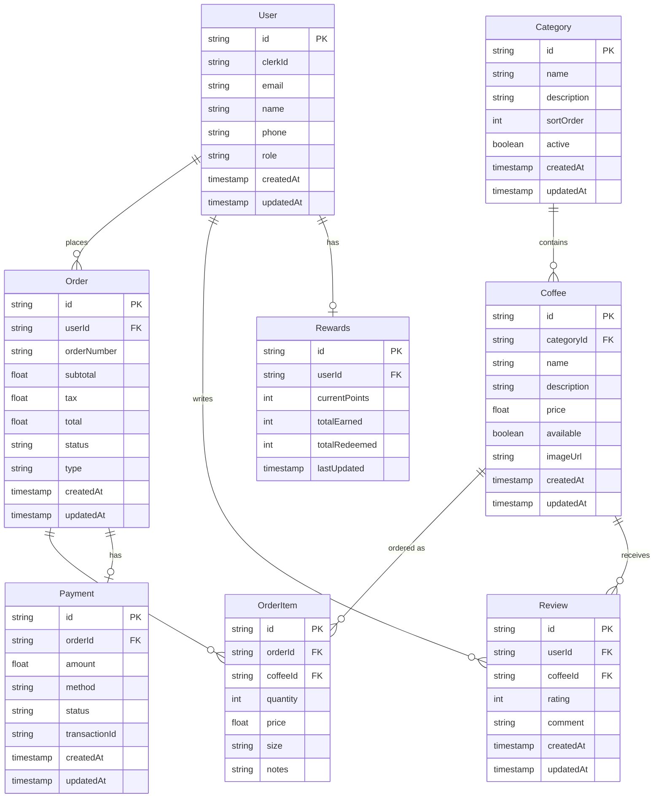

# Coffee Shop Database Schema

> **Note**: This database has been successfully seeded with authentic Chinese coffee shop data including categories like 浓缩咖啡 (Espresso), 手冲咖啡 (Filter Coffee), 冷萃咖啡 (Cold Brew), and 特色饮品 (Specialty Drinks).

## 🗄️ Database Structure

## 🔑 Key Tables

### Core Entities
- **User**: Customer accounts integrated with Clerk authentication
- **Coffee**: Coffee products menu (卡布奇诺, 拿铁, 美式, etc.)
- **Category**: Coffee categories (浓缩咖啡, 手冲咖啡, 冷萃咖啡, etc.)
- **Order**: Customer coffee orders with tracking
- **Rewards**: Customer loyalty points tracking

### Supporting Tables
- **OrderItem**: Individual coffee items in an order
- **Payment**: Payment transaction records
- **Review**: Customer ratings and feedback

## 📊 Enumerations

### User Roles
- `CUSTOMER` - Regular coffee shop customer
- `ADMIN` - Coffee shop administrator (future)
- `STAFF` - Coffee shop staff/barista (future)

### Order Status
- `PENDING` - Order placed, awaiting confirmation
- `CONFIRMED` - Order accepted
- `PREPARING` - Coffee being prepared
- `READY` - Ready for pickup/delivery
- `COMPLETED` - Order completed
- `CANCELLED` - Order cancelled

### Order Type
- `PICKUP` - Customer pickup from shop
- `DELIVERY` - Delivery to address (future)

### Coffee Sizes
- `SMALL` - 小杯
- `MEDIUM` - 中杯  
- `LARGE` - 大杯

### Payment Method
- `CREDIT_CARD` - Credit card
- `DEBIT_CARD` - Debit card
- `ALIPAY` - 支付宝
- `WECHAT_PAY` - 微信支付

### Payment Status
- `PENDING` - Payment pending
- `COMPLETED` - Payment successful
- `FAILED` - Payment failed
- `REFUNDED` - Payment refunded

## 📈 Relationships
- One user can have many orders and reviews
- One user has one rewards record
- Orders contain multiple coffee items (OrderItem)
- Each coffee belongs to one category
- Coffee items can receive multiple reviews
- Each order has one payment record

## 🔐 Key Constraints
- User email and clerkId must be unique
- Order number must be unique  
- All monetary values use decimal precision (10,2)
- Timestamps automatically managed (createdAt, updatedAt)
- Rating values between 1-5

## 💾 Database Configuration
- **Database**: PostgreSQL 15
- **ORM**: Prisma (TypeScript/JavaScript)
- **Port**: 5432 (default)
- **Database Name**: coffee_shop_db

## 📦 Sample Data

### Categories (5 total)
- **所有** (All) - 所有咖啡
- **浓缩咖啡** (Espresso) - 意式浓缩咖啡系列
- **手冲咖啡** (Filter) - 精品手冲咖啡
- **冷萃咖啡** (Cold Brew) - 冷萃和冰咖啡
- **特色饮品** (Specialty) - 特色创意咖啡

### Coffee Products (12+ items)
Popular items include:
- **卡布奇诺** (Cappuccino) - ¥25
- **拿铁咖啡** (Latte) - ¥28
- **美式咖啡** (Americano) - ¥22
- **摩卡咖啡** (Mocha) - ¥30
- **焦糖玛奇朵** (Caramel Macchiato) - ¥32
- **手冲单品** (Pour Over) - ¥35
- **冷萃咖啡** (Cold Brew) - ¥28
- **冰拿铁** (Iced Latte) - ¥30

## 🎯 Rewards System
Points calculation:
- Earn 1 point per ¥1 spent
- Redeem 200 points for free coffee
- Bonus points for special events
- Birthday rewards

## 🔄 Future Enhancements
- Add coffee customization options (shots, milk type, syrup)
- Implement subscription model for regular customers
- Add inventory tracking for coffee beans
- Include nutritional information
- Support for multiple shop locations