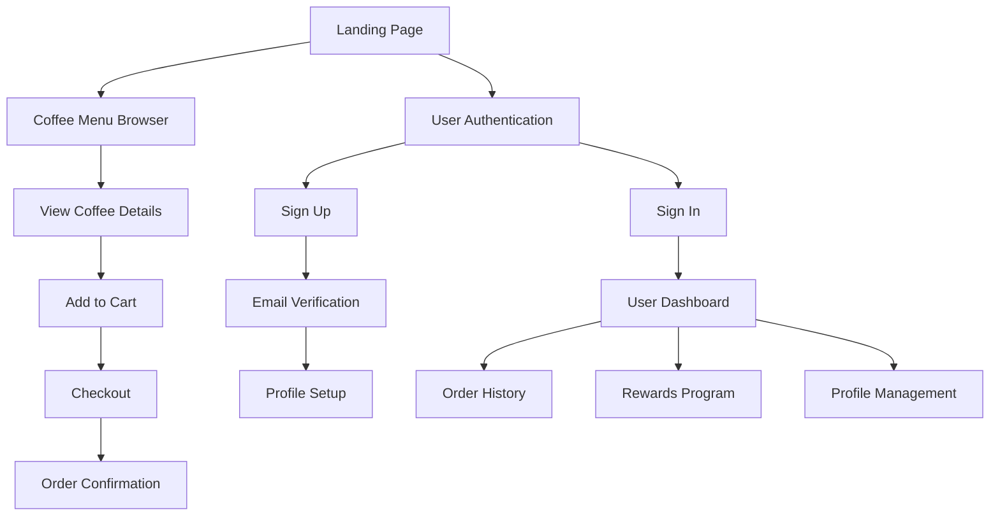

# Coffee Shop Features Overview

## ☕ Customer Features

## 🎯 Core Features

### 1. Coffee Menu System
- **Browse Coffee Selection**
  - Grid and list view options
  - Category filtering (浓缩咖啡, 手冲, 冷萃, etc.)
  - Search functionality
  - Price and rating display
  
- **Coffee Details**
  - High-quality product images
  - Detailed descriptions
  - Flavor notes and origin
  - Brewing recommendations
  - Customer ratings

### 2. User Authentication (已实现 ✅)
- **Custom Sign Up Flow**
  - Beautiful registration form
  - Email verification
  - Chinese language support
  - Error handling
  
- **Custom Sign In**
  - Styled login page
  - Password visibility toggle
  - Remember me option
  - Forgot password flow

### 3. User Profile (已实现 ✅)
- **Profile Information**
  - Email display
  - Phone number
  - Join date
  - Avatar placeholder
  
- **Account Management**
  - Sign out functionality
  - Update profile info
  - Change password

### 4. Rewards Program (已实现 ✅)
- **Points System**
  - Current points display
  - Progress bar to next reward
  - Points history
  
- **Rewards Catalog**
  - Free coffee rewards
  - Birthday rewards
  - Double points days
  
- **Earning Rules**
  - 1 point per ¥1 spent
  - Bonus for profile completion
  - Referral bonuses

### 5. Order Management
- **Shopping Cart**
  - Add/remove items
  - Quantity adjustment
  - Price calculation
  
- **Checkout Process**
  - Delivery/pickup options
  - Payment methods
  - Order confirmation
  
- **Order History**
  - Past orders list
  - Order status tracking
  - Reorder functionality

## 🎨 UI/UX Features

### Design System
- **Coffee Theme Colors**
  - Coffee Orange (#FE9870)
  - Coffee Cream (#F4E6CD)
  - Coffee Dark (#1B2037)
  - Coffee Gray (#D1D2D7)

### Mobile-First Design
- Responsive layouts
- Touch-friendly interfaces
- Optimized for mobile ordering
- PWA capabilities

### Chinese Language Support
- Full Chinese UI (中文界面)
- Chinese number formatting
- Localized date/time
- Chinese error messages

## 🛠️ Admin Features

### 1. Dashboard Overview
- **Real-Time Analytics**
  - Today's sales summary
  - Order statistics
  - Customer activity
  - Revenue tracking
  
- **Quick Actions**
  - Process pending orders
  - Update menu availability
  - View recent customers
  - Access reports

### 2. Menu Management
- **Product CRUD**
  - Add new coffee items
  - Edit existing products
  - Delete discontinued items
  - Bulk operations
  
- **Category Management**
  - Create categories
  - Reorder categories
  - Update descriptions
  
- **Inventory Control**
  - Set stock levels
  - Toggle availability
  - Price updates
  - Image management

### 3. Order Processing
- **Order Queue**
  - Real-time order updates
  - Status management
  - Order details view
  - Customer information
  
- **Order Actions**
  - Accept/reject orders
  - Update preparation status
  - Mark as ready
  - Handle cancellations

### 4. Customer Management
- **Customer Database**
  - View all customers
  - Search and filter
  - Order history per customer
  - Contact information
  
- **Rewards Management**
  - View points balance
  - Adjust points manually
  - Issue rewards
  - Track redemptions

### 5. Analytics & Reports
- **Sales Analytics**
  - Daily/weekly/monthly reports
  - Revenue charts
  - Popular items analysis
  - Peak hours identification
  
- **Customer Insights**
  - Customer retention
  - Average order value
  - Frequency analysis
  - Demographic data

### 6. Settings & Configuration
- **Shop Settings**
  - Business information
  - Operating hours
  - Holiday schedules
  - Contact details
  
- **System Configuration**
  - Payment methods
  - Tax settings
  - Notification preferences
  - Staff management

## 🔒 Security Features

### Authentication Security
- JWT token-based auth
- Secure password storage
- Email verification required
- Session management
- Role-based permissions

### Protected Routes
- Automatic redirects
- Loading states
- Error boundaries
- Role-based access control
- Admin-only route protection

## 📱 Page Structure

### Public Pages
1. **Landing Page** (`/`)
   - Coffee showcase
   - Call-to-action

2. **Home Page** (`/`)
   - Featured coffee
   - Category navigation
   - Quick add to cart

3. **Menu Page** (`/menu`)
   - Full menu browse
   - Advanced filtering
   - Search functionality

4. **Coffee Detail** (`/coffee/:id`)
   - Product information
   - Add to cart
   - Related products

5. **Authentication** 
   - Sign In (`/sign-in`)
   - Sign Up (`/sign-up`)
   - SSO Callback (`/sso-callback`)

### Protected Pages (Customer)
1. **Profile** (`/profile`)
   - User information
   - Account settings
   - Sign out

2. **Orders** (`/orders`)
   - Order history
   - Order tracking
   - Reorder

3. **Rewards** (`/rewards`)
   - Points balance
   - Available rewards
   - Points history

### Protected Pages (Admin)
1. **Dashboard** (`/admin/`)
   - Overview analytics
   - Quick actions
   - Recent activity

2. **Menu Management** (`/admin/menu`)
   - Product CRUD
   - Category management
   - Bulk operations

3. **Order Processing** (`/admin/orders`)
   - Live order queue
   - Status updates
   - Order details

4. **Customer Management** (`/admin/customers`)
   - Customer list
   - Search and filter
   - Customer details

5. **Analytics** (`/admin/analytics`)
   - Sales reports
   - Performance metrics
   - Export data

6. **Settings** (`/admin/settings`)
   - Shop configuration
   - System preferences
   - User management

## 🚀 Future Features

### Phase 2
- [ ] Shopping cart implementation
- [ ] Checkout flow
- [ ] Payment integration (Stripe/Alipay)
- [ ] Order tracking real-time
- [ ] Push notifications

### Phase 3
- [ ] Coffee subscription service
- [ ] Group ordering
- [ ] Coffee recommendations AI
- [ ] Social features (reviews, sharing)
- [ ] Multi-language support (English)

### Phase 4
- [ ] Advanced inventory with suppliers
- [ ] Marketing automation
- [ ] Loyalty campaign management
- [ ] Multi-location support
- [ ] Franchise management

## 📊 Technical Implementation Status

| Feature | Status | Priority |
|---------|--------|----------|
| Landing Page | ✅ Complete | High |
| User Authentication | ✅ Complete | High |
| Coffee Menu Browse | ✅ Complete | High |
| User Profile | ✅ Complete | High |
| Rewards Program | ✅ Complete | Medium |
| Protected Routes | ✅ Complete | High |
| Admin Dashboard | 🚧 In Progress | High |
| Admin Menu Management | 🚧 In Progress | High |
| Admin Order Processing | 🚧 In Progress | High |
| Admin Analytics | 🚧 In Progress | Medium |
| Admin Customer Management | 🚧 In Progress | Medium |
| Shopping Cart | 📋 Planned | High |
| Checkout Flow | 📋 Planned | High |
| Order History | 🚧 In Progress | Medium |
| Payment Integration | 📋 Planned | High |