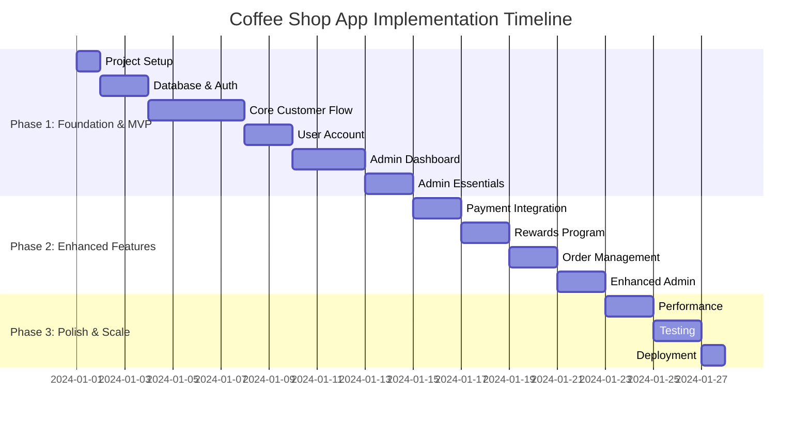
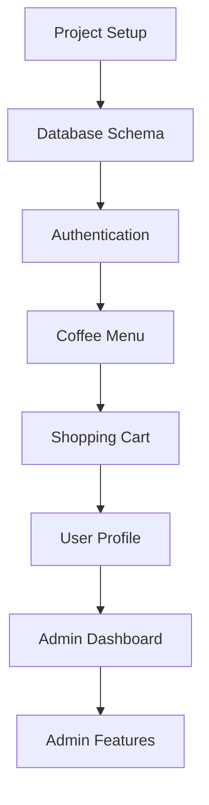
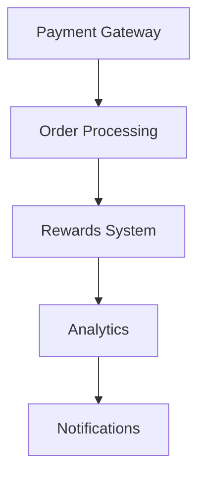
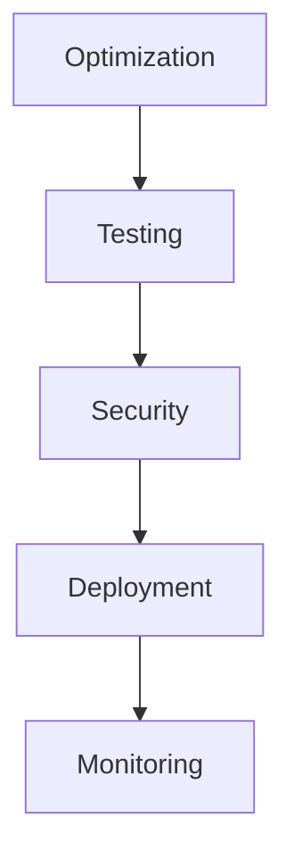

# Coffee Shop Implementation Guide

## 🚀 Implementation Phases



## 📋 Phase Breakdown

### Phase 1: Foundation & MVP
**Goal**: Launch a working coffee shop app that customers can use to order coffee



**Key Deliverables:**
- Monorepo with React + Vite frontend applications (landing, web, admin)
- PostgreSQL database with coffee shop schema
- Clerk authentication with custom Chinese UI and role-based access
- Coffee menu browsing with categories
- Shopping cart and basic checkout flow
- User profile with order history
- Admin dashboard with:
  - Menu management (CRUD operations)
  - Order processing interface
  - Basic analytics overview
  - Customer management

### Phase 2: Enhanced Features
**Goal**: Add critical business features for real operations



**Key Deliverables:**
- Payment integration (Stripe, Alipay, WeChat Pay)
- Real-time order tracking and status updates
- Rewards program with points and redemption
- Admin analytics dashboard
- Order notifications system

### Phase 3: Polish & Scale
**Goal**: Production-ready, performant application



**Key Deliverables:**
- Performance optimization (images, code splitting, caching)
- Comprehensive testing (unit, E2E, performance)
- Security hardening and audit
- CI/CD pipeline and production deployment
- Monitoring and error tracking

### Phase 4: Future Enhancements
- Multi-language support (English/Chinese toggle)
- Coffee subscription service
- AI recommendations based on order history
- Multiple shop locations
- Advanced analytics and BI tools
- Social features (reviews, sharing)

## 🛠️ Technology Stack

### Frontend
```typescript
// Core Technologies
- React 18 with TypeScript
- Vite for fast builds
- Tailwind CSS with custom coffee theme
- React Router for navigation
- Clerk for authentication

// Customer App Components
- Custom auth components
- shadcn/ui base components
- Lucide React icons
- Framer Motion animations

// Admin Dashboard Components
- Data tables with sorting/filtering
- Analytics charts (Recharts)
- Form management (React Hook Form)
- Real-time updates (WebSocket)
```

### Backend
```python
# Core Technologies
- FastAPI framework
- Prisma ORM
- PostgreSQL database
- JWT authentication via Clerk
- Python 3.11+

# Key Libraries
- pydantic for validation
- httpx for external APIs
- python-multipart for uploads
- websockets for real-time updates

# Admin Services
- Role-based middleware
- Admin-only endpoints
- Analytics aggregation
- Batch operations
```

### Infrastructure
- Docker for containerization
- Nginx for reverse proxy
- Redis for caching (future)
- AWS S3 for image storage

## 🎯 Key Implementation Decisions

### 1. **Mobile-First Design**
- All interfaces optimized for mobile ordering
- Touch-friendly UI elements
- Fast loading on 4G networks

### 2. **Chinese Language Primary**
- UI text in Chinese by default
- Proper date/time formatting
- CNY currency display
- Chinese payment methods

### 3. **Separate Admin Application**
- Dedicated admin dashboard at `admin.coffeeshop.com`
- Desktop-first design for efficiency
- Role-based access control with Clerk
- Real-time order updates
- Comprehensive analytics

### 4. **Incremental Features**
- Launch with core ordering flow
- Add payments after MVP
- Enhanced features based on user feedback

## 📊 Success Metrics

### MVP Milestones
- ✅ Customers can browse coffee menu
- ✅ Users can create accounts
- ✅ Basic cart and checkout flow
- ✅ Admin dashboard accessible
- ✅ Admin can manage products
- ✅ Admin can view orders
- ✅ Basic analytics available

### Enhanced Features Milestones
- ✅ Payment processing works
- ✅ Orders tracked in real-time
- ✅ Rewards program active
- ✅ Analytics dashboard live

### Performance Targets
- Page load < 2 seconds
- API response < 200ms
- 99.9% uptime
- Support 1000+ concurrent users

### Business Metrics
- Order completion rate > 80%
- User registration rate > 60%
- Rewards program adoption > 40%
- Admin efficiency improved 50%

## 🚀 Quick Start Commands

```bash
# Clone and setup
git clone <repo-url>
cd coffee-shop-app
pnpm install

# Setup Python environment with uv
uv venv
source .venv/bin/activate  # On Windows: .venv\Scripts\activate
uv pip install -r requirements.txt

# Environment setup
cp apps/landing/.env.example apps/landing/.env.local
cp apps/web/.env.example apps/web/.env.local
cp apps/admin/.env.example apps/admin/.env.local
cp apps/backend/.env.example apps/backend/.env

# Database setup
docker-compose up -d postgres
cd apps/backend
npx prisma migrate dev
uv run python seed.py  # Load sample coffee data

# Start development
pnpm dev  # Starts all services

# Access applications
# Landing: http://localhost:5174
# Web App: http://localhost:5173
# Admin Dashboard: http://localhost:5175
# Backend: http://localhost:5001
# API Docs: http://localhost:5001/docs
```

## 🔒 Security Considerations

1. **Authentication**: Clerk handles auth securely
2. **API Security**: All endpoints validated with role checks
3. **Payment Security**: PCI compliance via Stripe
4. **Data Protection**: Encrypted connections
5. **Admin Access**: 
   - Role-based permissions via Clerk metadata
   - Separate admin application for isolation
   - Audit logging for admin actions
   - Session timeout for inactive admins

## 📱 Deployment Strategy

### Development → Staging → Production

1. **Development**: Local Docker environment
2. **Staging**: Preview deployments on Vercel
3. **Production**: 
   - Landing: Vercel at coffeeshop.com
   - Web App: Vercel at app.coffeeshop.com
   - Admin: Vercel at admin.coffeeshop.com
   - Backend: Railway/Render at api.coffeeshop.com
   - Database: Managed PostgreSQL

## 🎨 Design Principles

1. **Coffee Theme Colors**
   - Primary: Coffee Orange (#FE9870)
   - Secondary: Coffee Cream (#F4E6CD)
   - Dark: Coffee Dark (#1B2037)

2. **Typography**
   - Headers: Montserrat
   - Body: Kumbh Sans

3. **User Experience**
   - One-thumb navigation
   - Clear CTAs
   - Minimal steps to order

## 🤝 Team Collaboration

### Development Workflow
1. Feature branches from `main`
2. PR reviews required
3. Automated testing on PR
4. Deploy to staging first
5. Production deploy after QA

### Communication
- Daily standups
- Weekly demos
- Slack for quick questions
- GitHub issues for bugs

---

**Ready to build your coffee shop? Let's brew some code! ☕**