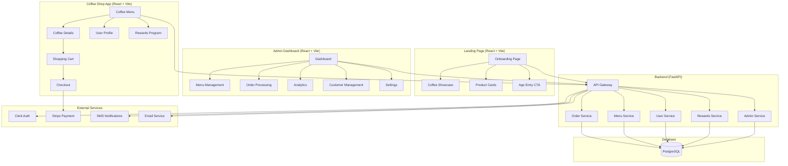
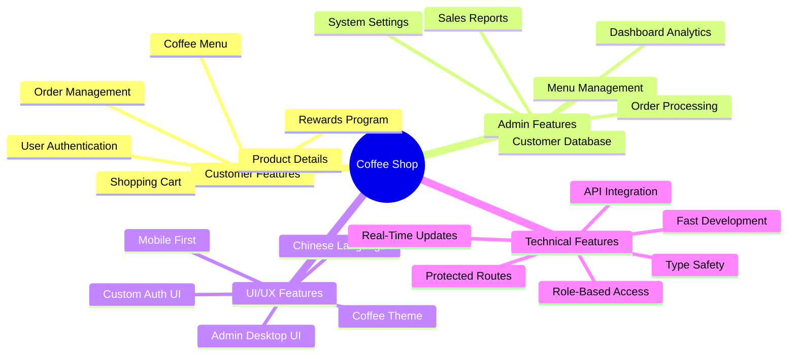
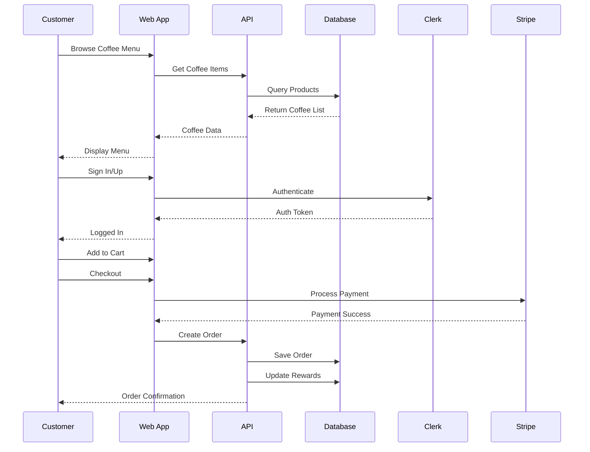
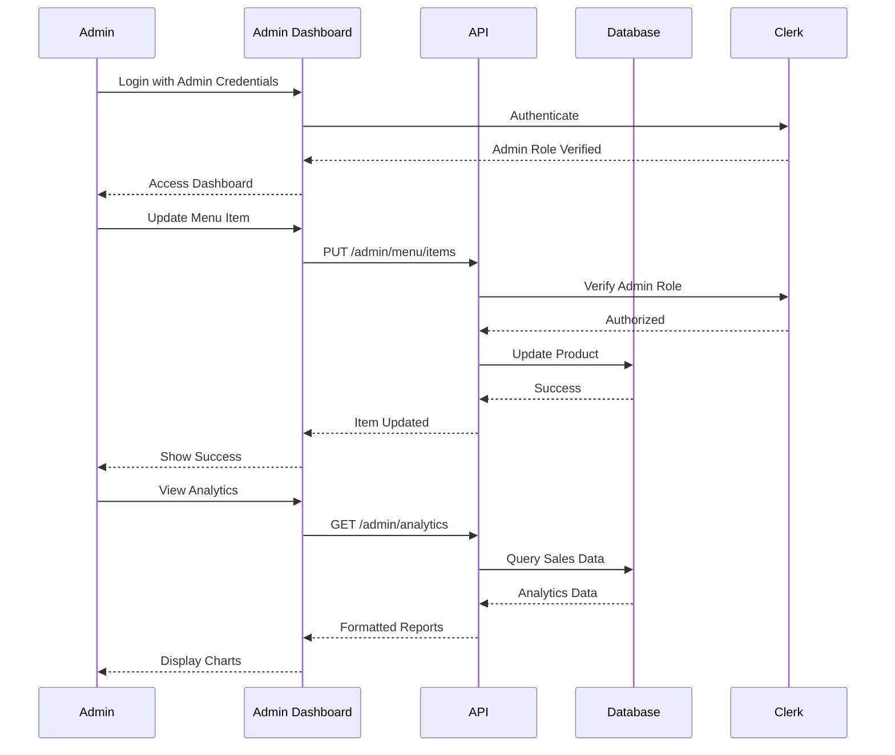
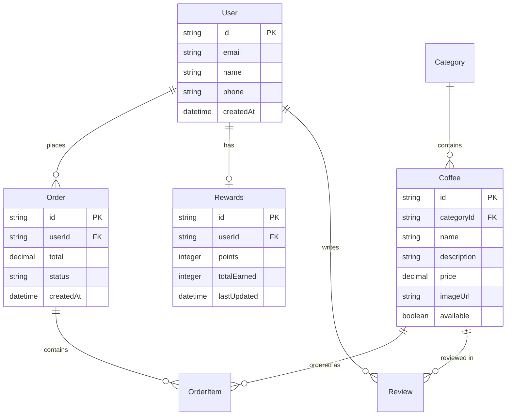
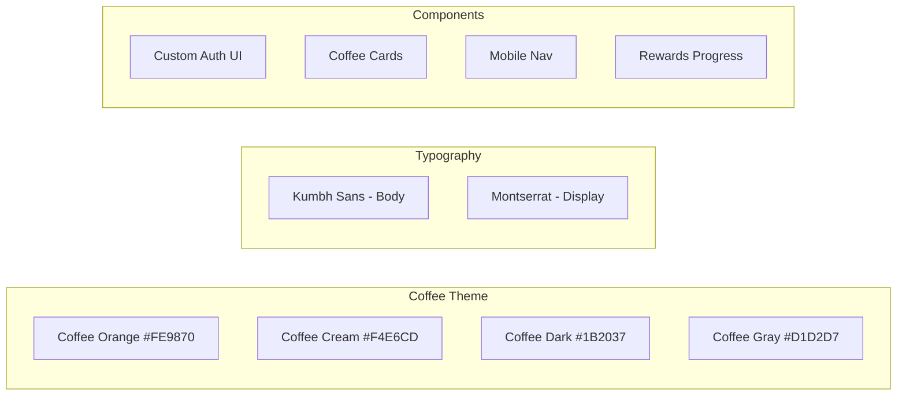
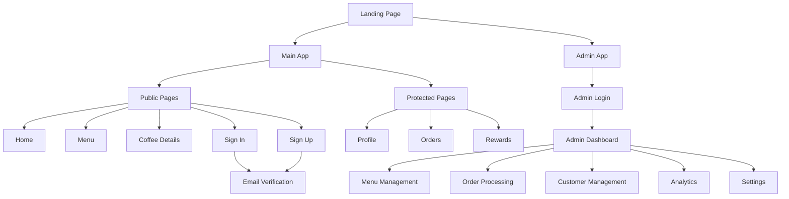
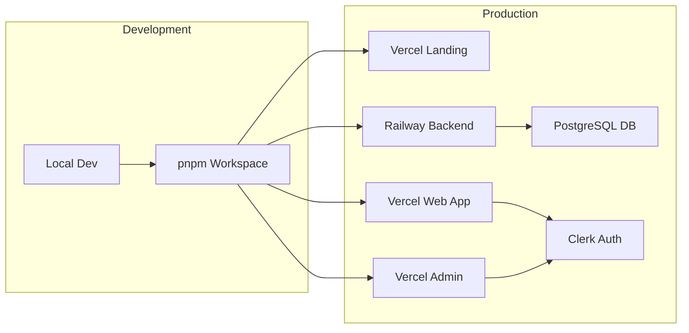

# Coffee Shop App - Project Overview

## 🏗️ System Architecture

## ☕ Core Features

## 🔄 Order Flow

## 👨‍💼 Admin Flow

## 🗄️ Data Model

## 🎨 Design System

## 📱 Page Structure

## 🚀 Deployment

## Tech Stack

### Frontend
- **Landing Page**: React 18, Vite, Tailwind CSS
- **Web App**: React 18, Vite, Tailwind CSS, Clerk
- **Admin Dashboard**: React 18, Vite, Tailwind CSS, Clerk (Admin Role)
- **UI Components**: Custom auth UI, shadcn/ui base, Admin-specific components
- **State Management**: React hooks, Context API for admin state
- **Routing**: React Router v6 with role-based guards
- **Data Visualization**: Recharts for analytics

### Backend
- **API**: FastAPI (Python) with role-based endpoints
- **Database**: PostgreSQL with Prisma ORM
- **Authentication**: Clerk JWT verification with role checking
- **Admin Services**: Dedicated admin API routes
- **Real-Time**: WebSocket support for live updates
- **Hosting**: Railway/Render

### Key Features Implemented
- ✅ Beautiful onboarding page
- ✅ Custom authentication UI
- ✅ Coffee menu browsing
- ✅ Product details view
- ✅ User profiles
- ✅ Rewards program
- ✅ Protected routes
- ✅ Chinese language support
- 🚧 Admin dashboard
- 🚧 Menu management CRUD
- 🚧 Order processing system
- 🚧 Customer management
- 🚧 Sales analytics

### Upcoming Features
- 📋 Shopping cart
- 📋 Checkout flow
- 📋 Payment integration
- 📋 Order tracking
- 📋 Push notifications
- 📋 Real-time order updates
- 📋 Advanced reporting